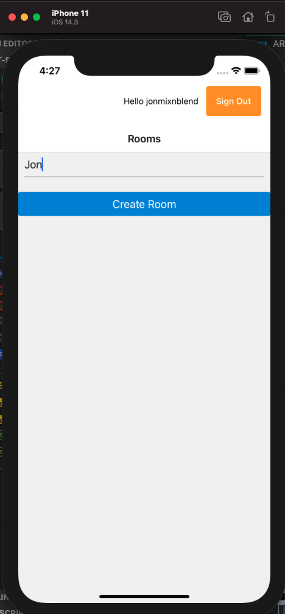
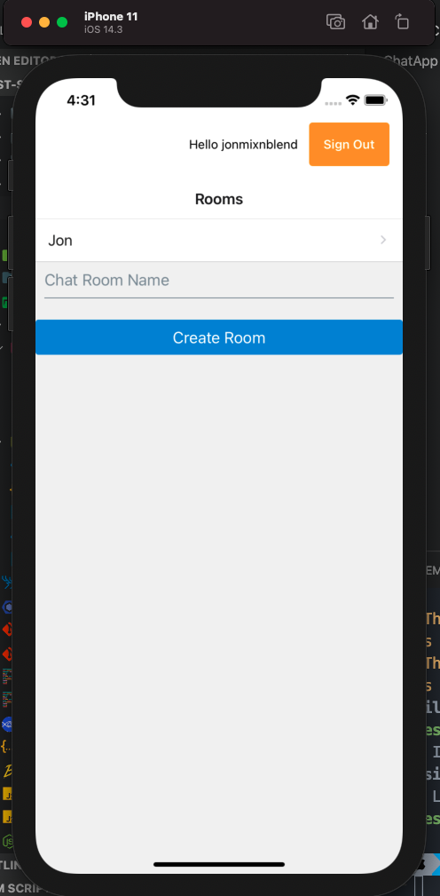

# First Steps with AWS Appsync

Synchronizing Data between the frontend and backend in a real-time, seamless way is a hard problem to solve.
Appsync is the service suggested by AWS as the way to solve this problem in an easy manner. It's the AWS
equivalent of Google's Firebase.

The thing about Firebase in my admittedly limited experience is that while it gives you an incredibly rich feature set out of the box, as your app grows, it basically asks you to sell your soul or a first born to cover the usage costs. Aside from that, there is still the ongoing Google/Huawei saga, where you cannot use any SDK's which use Google Play Services on a Huawei device.

To date, we haven't had an opportunity to use it (AppSync) in one of our React Native Apps, so, with that in mind, I set out today with the goal of setting up a basic project, and seeing what the state of play is with regard to maturity, usability, and cost implications of using it as opposed to its Google Counterpart.

Let's go.

## The Start

First things first, I browsed on over to the [App Sync](https://aws.amazon.com/appsync/) home page, where a helpful link invites me to 'Get Started With App Sync'. Some of the benefits it's promising me are:

- Simple and secure data access using GraphQL (Ok, I've been sold the GraphQL kool-aid before but always been a little suspicious of swallowing its benefits wholesale, let's see where this goes).
- Built in real-time and offline capabilities through managed GraphQL subscriptions, pushing real time updates to Websockets (sounds great).
- No Servers to manage Create a GraphQL API in seconds via the AWS CLI, console, Amplify CLI or CloudFormation) (Ok, this sounds great in theory, however I'm always a bit suspicious of automagical CLI's that create a magically working app, without much access or insight to what is going on under the hood).

Now I want to just get a basic example app up and running and I want to save time. After clicking on an example Todos's tutorial, I'm pushed towards using Amplify. I don't want to do this. I don't want to do this because in my experience these kinds of tools work great until they don't and then you are screwed. Ok, let's see what else I can find on setting up the API side of things.

[This](https://dev.to/dabit3/full-stack-serverless-building-a-real-time-chat-app-with-graphql-cdk-appsync-and-react-1dbb) looks like a pretty interesting guide to setting something up using CDK (which I am familiar with and like), and React. Ok it's not React Native, but that shouldn't be a problem to sort out.

It took a short while to go throught the backend setup and get a GraphQL API with Auth via Cognito defined, but, due to the clear and concise article listed above, in about 20 minutes I have one set up and deployed via CDK.

## React Native App

Ok, so now I have set up the backend, the next step is to generate a new react native project using the react native cli, using typescript. That takes a few minutes.

Then, things get a little tricky. There are a lot of resources out there, and they aren't all coherent. For the frontend, I am going to use amplify as the react native packages for it seem to come with some pretty nice higher order components for dealing with Auth.

So first I install:

`npm install --save amazon-cognito-identity-js aws-amplify aws-amplify-react-native @react-native-community/netinfo`

After searching around for a little while, I come across this guide to [configuring Amplify](https://docs.amplify.aws/lib/auth/start/q/platform/js), specifically for creating or re-using an existing backend, and then follow [this guide](https://docs.amplify.aws/ui/auth/authenticator/q/framework/react-native) to adding the neccessary higher order components to my application. They do look pretty customisable, but I'm going to leave them plain vanilla for the moment.

That was pretty easy to set up, and within 20 minutes, I had a working example integrated with Cognito. On to the Chat App.

After installing and configuring [react-navigation](https://reactnavigation.org/docs/hello-react-navigation), and configuring a Stack navigator, I set up a functional component, ChatApp/src/Rooms.tsx in the source repo, to list and create my chat rooms. I'm using useReducer here and packing everything including actions into one file, which I would never do in real life, but for the purposes of my POC and given the fact that I have one day, I'm just going to do the bare minimum.

At this point, I have to [add the following](https://docs.amplify.aws/lib/graphqlapi/create-or-re-use-existing-backend/q/platform/js) to my amplify config:

```json
    "aws_appsync_graphqlEndpoint": "endpoint-for-your-graphql-api-here",
    "aws_appsync_region": "your-region",
    "aws_appsync_authenticationType": "AMAZON_COGNITO_USER_POOLS"
```

Once I've done that, I can start the app on iOS and create a chat room with my name to join.





I must add at this point that I have copied the generated GraphQL code out of the example React App from that article above and that is all well and good, but it's not really going to help much in the real world if I have a pretty large GraphQL schema.

Well, it turns out I can [add GraphQL codegen](https://docs.amplify.aws/cli/graphql-transformer/codegen#amplify-add-codegen) to my project to generate whatever Typescript, Swift etc I need from my schema, without adding the whole of Amplify.
